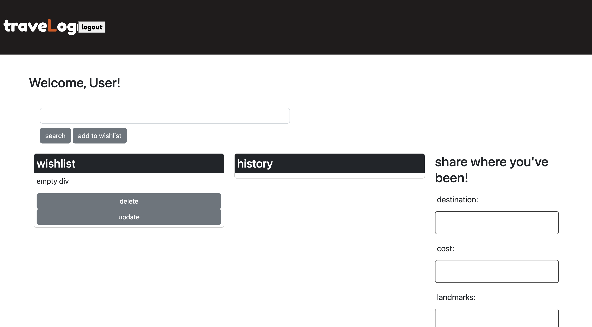

# `TraveLog`

This application is designed to, firstly, authenticate users before they enter the site. Once past the login prompt, a user would be able to create a wishlist of places they'd like to visit and store key pieces of information such as: cost, destination, landmarks, and duration. Users could create a history of places they've been and notes about their journeys. 

## Links

[TraveLog](https://serene-sierra-18598.herokuapp.com/login)  
[GitHub_Repository](https://github.com/kylelarsenlarsen/Trip-Tracker)

## Credits

Created by [Beck Straub](https://github.com/bckstrb)  
Created by [Cory Carroll](https://github.com/CoryCarroll)  
Created by [Marshall Jacob](https://github.com/MarshallJacob)  
Created by [Kyle Larsen](https://github.com/kylelarsenlarsen)  